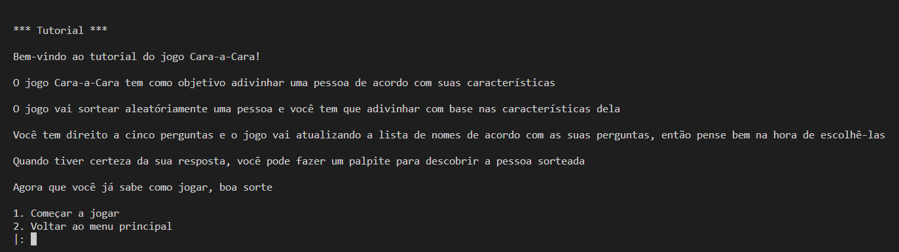
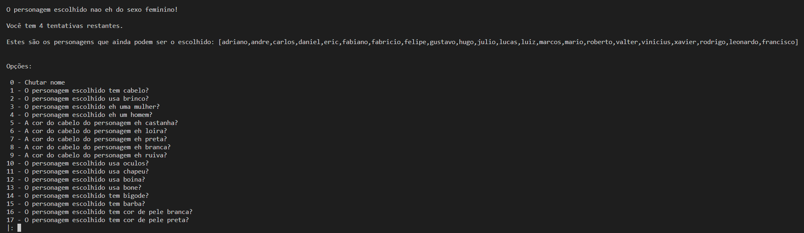

# CaraCara

**Disciplina**: FGA0210 - PARADIGMAS DE PROGRAMAÇÃO - T01 <br>
**Nro do Grupo**: 04<br>
**Paradigma**: Lógico<br>

## Alunos
|Matrícula | Aluno |
| -- | -- |
| 18/0096991  |  Álvaro Leles |
| 18/0100831  |  Gabriel Avelino |
| 18/0145088  |  Gabriel Bonifácio |
| 18/0101617  |  Guilherme de Morais |
| 18/0102087  |  Ian Fillipe |
| 18/0113666  |  Ítalo Guimarães |
| 18/0102656  |  Ítalo Vinícius |
| 20/0043111  |  Ricardo De Castro |

## Sobre 
<p style="text-indent: 20px; text-align: justify">
Para a entrega do paradigma lógico, foi escolhido o jogo clássico de tabuleiro Cara-a-Cara, no qual o objetivo é descobrir as pessoas (peças) do outro jogador, através de dicas sobre as características únicas de cada peça do jogador. Nessa versão, o jogador tentara adivinhar a pessoa que a máquina ira gerar a partir de uma base de dados que foi criada baseada no verdadeiro Cara-a-cara, adivinhando se a pessoa escolhida possui ou não as características.
</p>

## Screenshots

### Tutorial


### Começando a jogar


## Instalação 
**Linguagens**: PROLOG<br>
**Tecnologias**: SWI-Prolog<br>

(É necessário para rodar esta aplicação SWI-Prolog e recomenda-se rodá-la no ambiente Ubuntu ou utilizando no windows o WSL)

## Uso 
1- No terminal, basta executar o seguinte comando:

```
swipl menu.pl
```

A partir daí, basta jogar conforme as instruções descritas no terminal, lembrando sempre de adicionar um ponto final(.) ao final de cada entrada.

## Vídeo
Adicione 1 ou mais vídeos com a execução do projeto.
Procure: 
(i) Introduzir o projeto;
(ii) Mostrar passo a passo o código, explicando-o, e deixando claro o que é de terceiros, e o que é contribuição real da equipe;
(iii) Apresentar particularidades do Paradigma, da Linguagem, e das Tecnologias, e
(iV) Apresentar lições aprendidas, contribuições, pendências, e ideias para trabalhos futuros.
OBS: TODOS DEVEM PARTICIPAR, CONFERINDO PONTOS DE VISTA.
TEMPO: +/- 15min

## Participações
|Nome do Membro | Contribuição | Significância da Contribuição para o Projeto (Excelente/Boa/Regular/Ruim/Nula) |
| -- | -- | -- |
| Álvaro Leles  | Participei das definições iniciais do projeto, como construção da metodologia e da base de conhecimento e contribuí com o desenvolvimento inicial e final do projeto principalmente  | Boa |
| Gabriel Avelino  |  Participei das criações do menu e da lógica do projeto | Boa |
| Gabriel Bonifácio  | Criação da função Jogo, da introdução inicial e contribuição na funcionalidade de chutar o nome, além de participações em outras funções.  | Excelente |
| Guilherme de Morais  |  Participei da criação das lógicas para contagem de tentativas, criação de condicionais e lógica de filtragem de personagens sobre as perguntas feitas pelo jogador. | Excelente |
| Ítalo Alves  | Contribuição na criação dos personagens na base de dados, implementação do tutorial e das mensagens nos menus. | Boa |
| Ian Fillipe  | Implementei a estratégia de realizar a interseção de listas para fazer a filtragem de personagens, participei da criação da regra 'jogo', e dei suporte no desenvolvimento de outra partes do projeto | Excelente |
| Ítalo Vinícius  | Participei de grande parte do desenvolvimento da lógica do jogo e para resolver os problemas que estávamos tendo | Excelente |
| Ricardo Castro  | Contribuição para popular a base de dados e implementação dos menus e do tutorial. | Boa |

## Outros 
Quaisquer outras informações sobre o projeto podem ser descritas aqui.
(i) Lições Aprendidas;
(ii) Percepções;
(iii) Contribuições e Fragilidades, e
(iV) Trabalhos Futuros.

## Fontes
- [Tutorial de prolog](https://cs.union.edu/~striegnk/learn-prolog-now/html/)
- [Outro tutorial de prolog](https://cs.union.edu/~striegnk/learn-prolog-now/html/)
- [Varaiveis globais](https://www.swi-prolog.org/pldoc/man?section=gvar)
- [Listas (documentação oficial)](https://www.swi-prolog.org/pldoc/doc/_SWI_/library/lists.pl)
- [Listas em Prolog](https://www.tutorialspoint.com/prolog/prolog_lists.htm)
- [Documentação SWI-Prolog](https://www.swi-prolog.org)
- Além dos vídeos disponibilizados no moodle UnB da discplina
